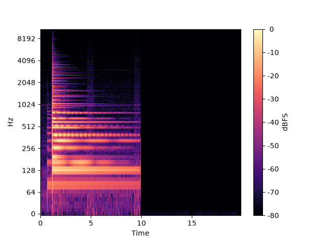

# 🎸 Automatic-Chord-Transcription-CNN

-orange.svg)

**WIP**

Transcripción Automática de Acordes mediante **Redes Neuronales Convolucionales (CNN)**.

  

Este proyecto tiene como objetivo desarrollar un modelo de Deep Learning capaz de identificar y transcribir acordes musicales a partir de señales de audio crudas. El modelo procesa **cromagramas**, analizando cómo se distribuye la energía en las 12 clases de notas musicales a lo largo del tiempo.

> ⚠️ **Nota:** El desarrollo del proyecto está estructurado en 5 etapas progresivas. Estas fases representan la planificación inicial y son susceptibles a adaptaciones según los retos técnicos que surjan.

---

## Etapas de Desarrollo

### 1. Extracción de Características
El objetivo inicial es comprender y validar los datos de entrada antes de aplicar Inteligencia Artificial.
-  Procesamiento de audios aislados en arrays bidimensionales usando `librosa`.
-  Generación de cromagramas.
-  Visualización para confirmar la representación de los acordes.

### 2. Producto Mínimo Viable (MVP)
Un entorno controlado y simplificado para validar la viabilidad del flujo de trabajo de la red neuronal.
-  Restricción del problema a clasificación binaria (ej. *Do Mayor* vs. *Sol Mayor*).
-  Creación de un dataset sintético limpio (50 audios por clase, instrumentos virtuales, sin ruido).
-  Uso de audios completos como una única imagen de entrenamiento, sin aplicar ventanas temporales.

### 3. Diseño y Entrenamiento de la CNN
Adaptación del reconocimiento de imágenes al contexto de la música.
- Definición del modelo con capas convolucionales (`Conv2D`) para buscar texturas espaciales (notas encendidas simultáneamente).
- Implementación de capas de `MaxPooling` para reducir la dimensionalidad y tolerar variaciones en el tempo.

### 4. Ventanas Deslizantes (Sliding Windows)
Análisis de pistas de audio reales continuas.
-   División de los archivos de audio en ventanas temporales cortas (fragmentos de 0.5 a 1.0 segundos).
-  Sincronización exacta entre los fragmentos de audio extraídos y los archivos de texto de etiquetado temporal.

### 5. Datasets Reales y Desbalanceo de Clases
Escalado del modelo a entornos de validación con datos reales complejos.
-  Integración de datasets estándar de la industria (ej. *GuitarSet*).
-  Aplicación de técnicas de mitigación de sesgo estadístico (como *Weighted Cross-Entropy*) para evitar que el modelo sobreprediga los acordes más comunes.

---

## Tecnologías Utilizadas

| Categoría | Herramienta | Propósito en el proyecto |
| :--- | :--- | :--- |
| **Lenguaje** |  | Entorno base del proyecto. |
| **Audio** | `librosa` | Extracción de características de la señal y generación de cromagramas. |
| **Deep Learning** | `PyTorch` | Diseño, entrenamiento y evaluación de la Red Neuronal Convolucional. |
| **Datos** | `NumPy`, `Pandas` | Operaciones matriciales rápidas y sincronización de etiquetas de tiempo. |
| **Visualización** | `Matplotlib` | Generación de espectrogramas visuales para depuración. |
